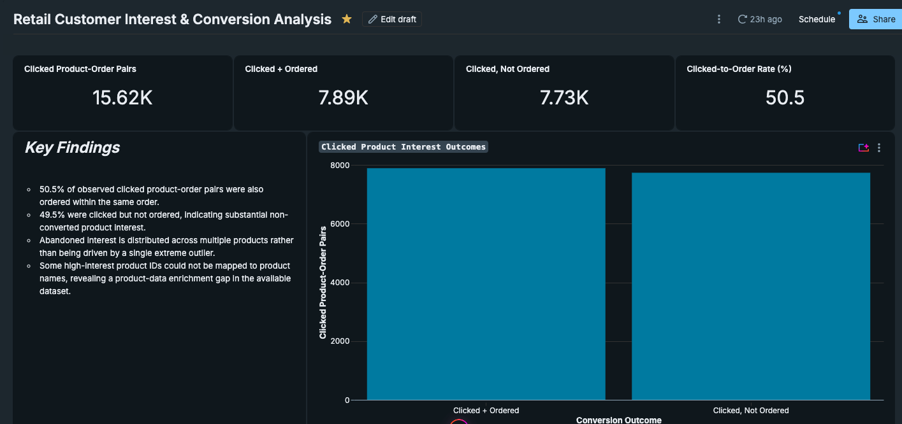

# retail-customer-interest-conversion
Databricks SQL analysis of retail customer product interest, purchase conversion, abandoned interest, and data-quality gaps.

# Retail Customer Interest & Conversion Analysis

A Databricks SQL analysis examining how customer product interest translates into purchases, where clicked products fail to appear in completed orders, and where data-quality gaps limit interpretation.

## Business Problem

Customer purchase data explains what customers bought, but it does not necessarily show what they considered before purchasing.

This analysis uses product-click behavior alongside order data to investigate:

- How often clicked product interest results in a purchase within the same order
- Which products repeatedly receive clicks but are not subsequently ordered
- Whether non-conversion is concentrated in a small number of products or distributed across the catalog
- Where gaps in product data limit further analysis

The goal is to identify patterns that could support deeper investigation into pricing, availability, assortment, promotions, or customer experience without assuming that every unconverted click represents lost revenue.

## Dataset

The analysis uses the Databricks simulated retail customer dataset:

`databricks_simulated_retail_customer_data.v01`

Primary tables:

- `customers`
- `sales`
- `sales_orders`

A key challenge was that `clicked_items` was stored as a string containing nested JSON arrays rather than analysis-ready rows. `ordered_products` also contained semi-structured product records.

## Analytical Approach

The analysis began by inspecting table grain, schemas, product identifiers, and the structure of the semi-structured fields.

The click data was then transformed from:

`STRING → ARRAY<ARRAY<STRING>> → individual clicked product IDs`

Using Databricks SQL, I:

1. Parsed nested JSON with `from_json()`
2. Expanded arrays into rows using `explode()`
3. Extracted product identifiers from semi-structured fields
4. Preserved `order_number` so clicks and purchases could be compared within the same order
5. Used a `LEFT ANTI JOIN` to identify clicked products with no matching ordered product
6. Used `COUNT(DISTINCT order_number)` to prevent duplicate product appearances within an order from inflating abandoned-interest counts
7. Constructed an order-level click-to-purchase KPI
8. Built a Databricks AI/BI dashboard to communicate the findings

## Key Findings

The analysis identified **15,619 distinct clicked product-order pairs**.

- **7,887** clicked product-order pairs also appeared among products ordered within the same order
- **7,732** were clicked but not ordered
- The resulting **click-to-order rate was 50.50%**
- Approximately **49.50%** of observed clicked product interest did not result in a same-order product match

The near-even split indicates substantial non-converted product interest worth investigating further.

Abandoned interest was also distributed across multiple products rather than being driven by one extreme outlier.

## Data Quality Finding

Some frequently clicked product IDs could not be mapped to usable product names through the available sales-side product data.

Rather than removing these records, the analysis retained them as unmapped product IDs.

This preserves potentially meaningful customer-interest signals while making the data-quality limitation visible.

A more complete product dimension or catalog would improve product-level investigation.

## Interpretation Guardrail

A product click does **not** necessarily represent purchase intent.

For that reason, this project uses terms such as **clicked but not ordered**, **abandoned interest**, and **non-conversion** rather than claiming confirmed cart abandonment or lost revenue.

The available data identifies **where** non-conversion occurs, but it does not establish **why**.

Potential causes such as pricing, inventory availability, assortment, promotions, comparison behavior, or customer experience remain hypotheses requiring additional evidence.

## Business Opportunity

The results provide a starting point for investigating products with high abandoned interest.

With additional product, pricing, inventory, promotion, and behavioral data, the analysis could help determine whether repeated non-conversion reflects:

- Product availability issues
- Pricing or promotion opportunities
- Assortment gaps
- Customer comparison behavior
- Product-page or purchasing-experience friction

The appropriate next step is deeper investigation rather than assuming that every non-converted click represents recoverable revenue.

## Technical Skills Demonstrated

- Databricks SQL
- Semi-structured JSON parsing
- `from_json()`
- `explode()`
- Arrays and structs
- CTEs
- `LEFT JOIN`
- `LEFT ANTI JOIN`
- `CASE`
- `COALESCE`
- `COUNT(DISTINCT)`
- Aggregation
- Data-grain validation
- Product-ID reconciliation
- Data-quality investigation
- KPI construction
- Analytical guardrails
- Databricks AI/BI dashboard development
- Business-oriented data storytelling

## Repository Contents

- `retail_interest_conversion_analysis.sql` — validated Databricks SQL used for data interrogation, transformation, abandoned-interest analysis, and conversion KPI construction
- `retail_interest_conversion_dashboard.png` — published Databricks AI/BI dashboard

## Dashboard

The final dashboard summarizes the analysis through four primary KPIs and two supporting visualizations:

- Clicked Product-Order Pairs
- Clicked + Ordered
- Clicked, Not Ordered
- Click-to-Order Rate
- Clicked Product Interest Outcomes
- Top Products with Abandoned Interest

The dashboard was designed to move from overall conversion performance to specific areas requiring further investigation.
